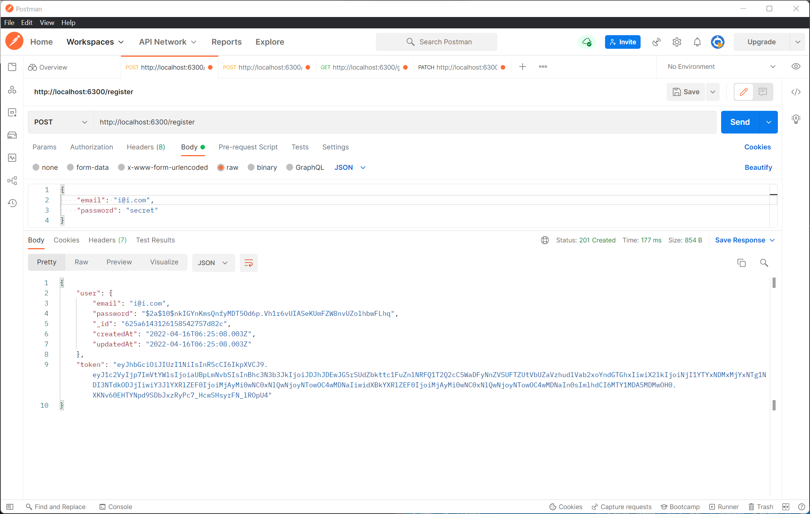
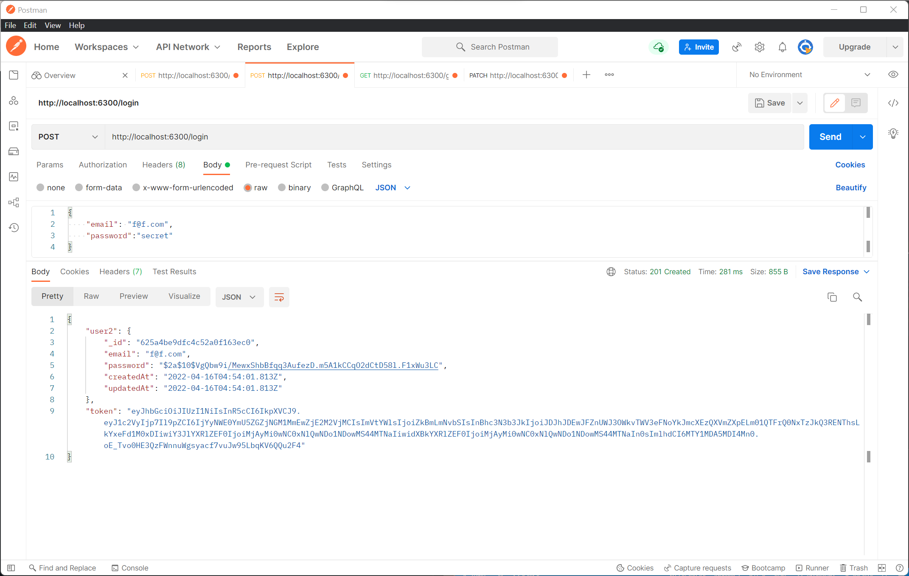
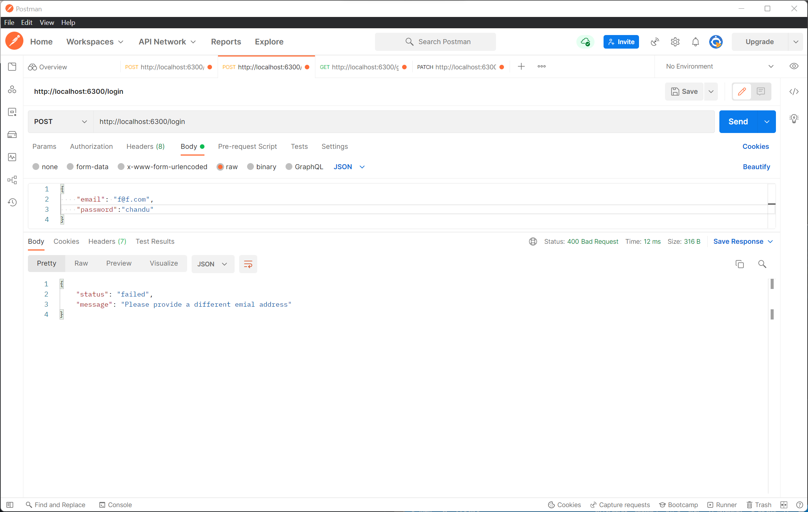
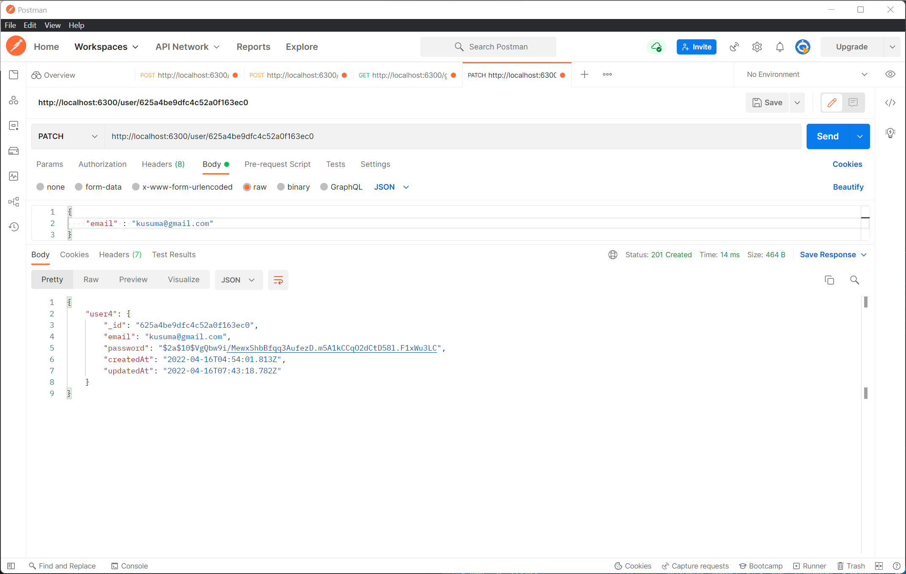
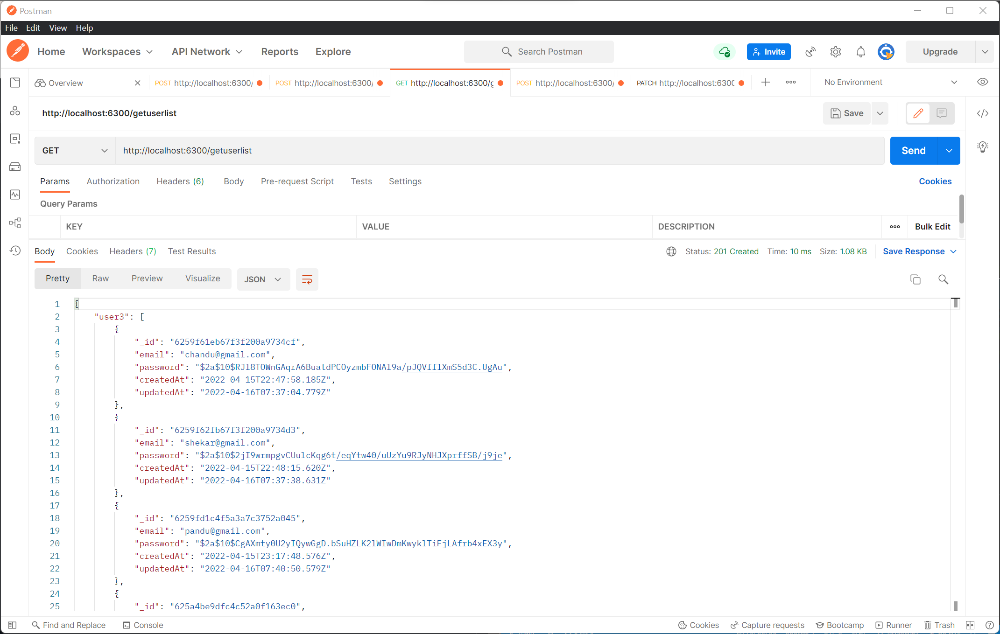

<h1>User Authentication</h1>

<h3>Tech stack used :</h3>

<li>
    <ul>javascript</ul>
    <ul>Express.js</ul>
    <ul>Node.js</ul>
    <ul>MongoDB</ul>
</li>

There are different packages used in this application for backend REST api developement,

In this application the user can register with the details (email and password)

This picture refers to the working of api endpoint with which user can register with their details,

The jasonwebtoken package is used in this application to create security for the details of users

The above picture refers to the endpoint for login where the user can logs in securely, this process is done securely with the JWT function where the access tokens are created which are unique for every individual

Every user should login with the proper credentials which user uses while registering, If the password or email entered cannot match with the data stored in database the user wouldn't get access to login with the application

User can update his/her details by using the endpoint "/user/:id". This endpoint finds the user details by unique id and updates the data which will change automatically in database management system

The total users for the application can be easily available with the endpoint called get request.

